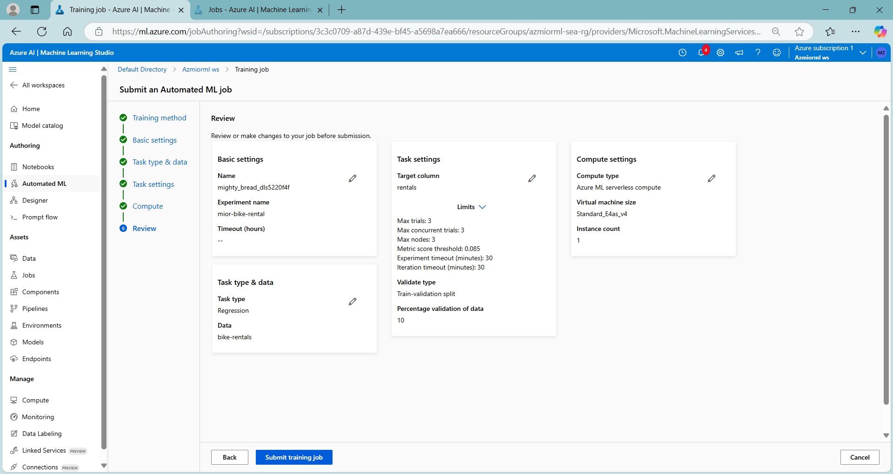
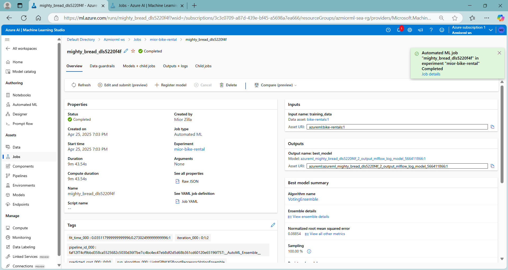
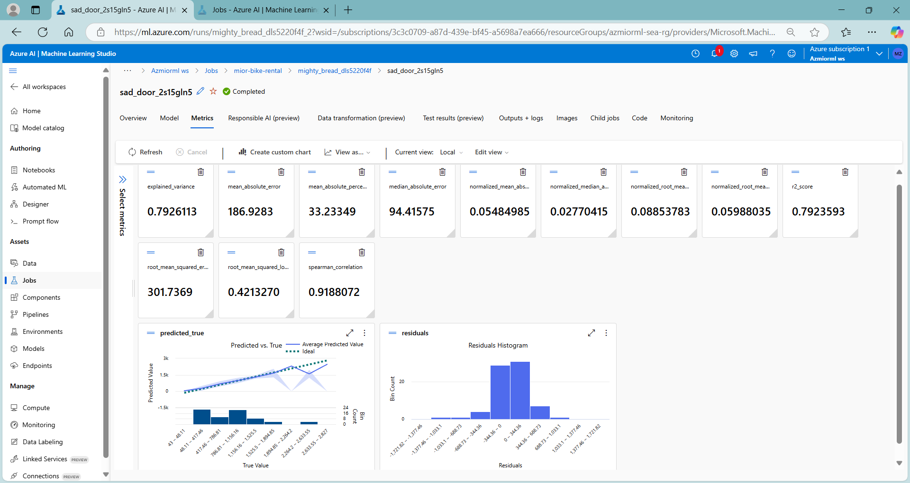
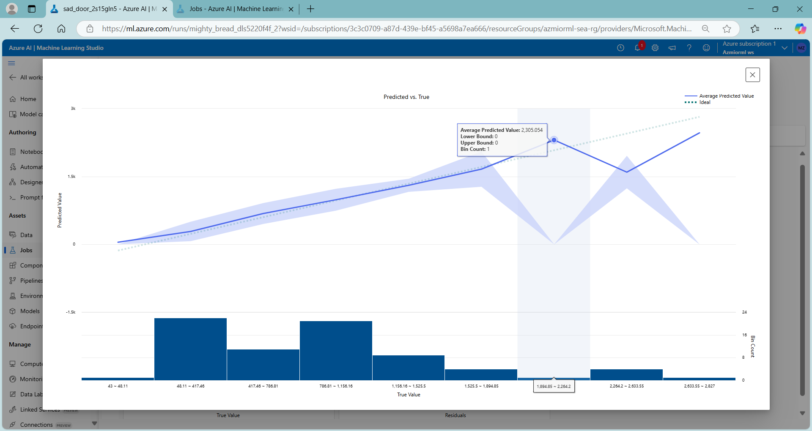
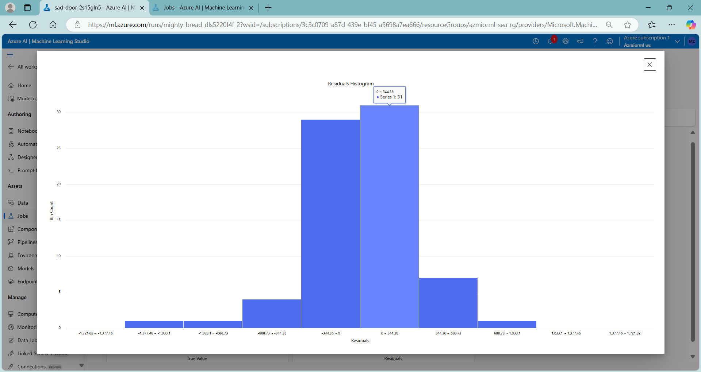
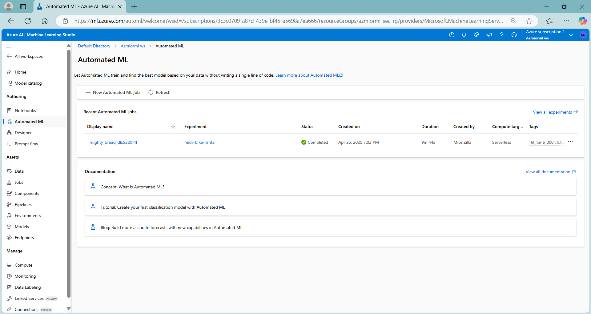
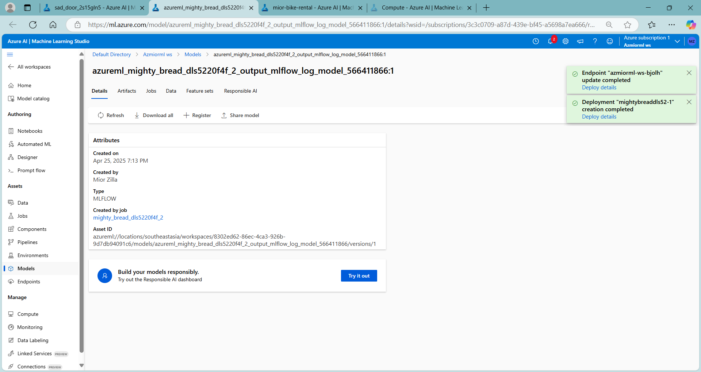
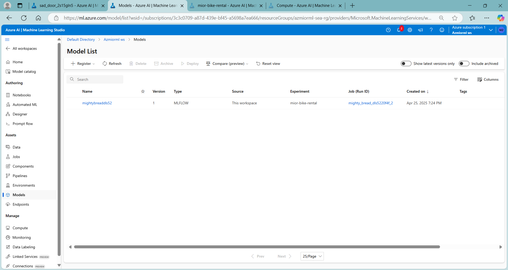
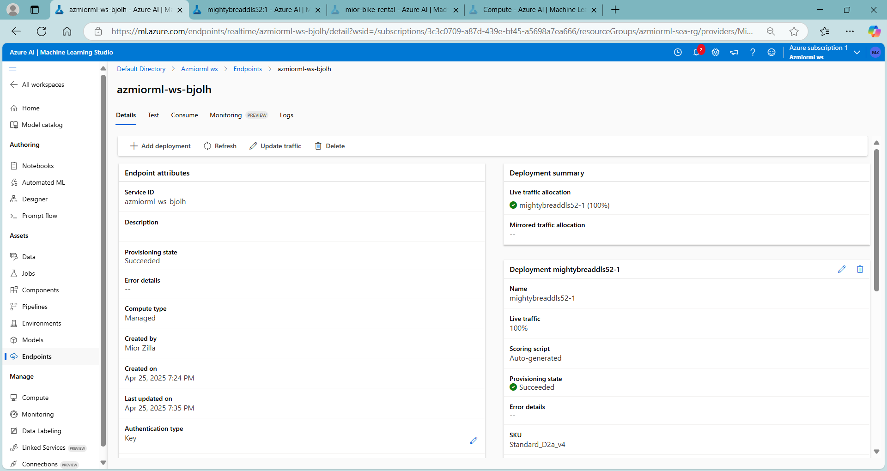
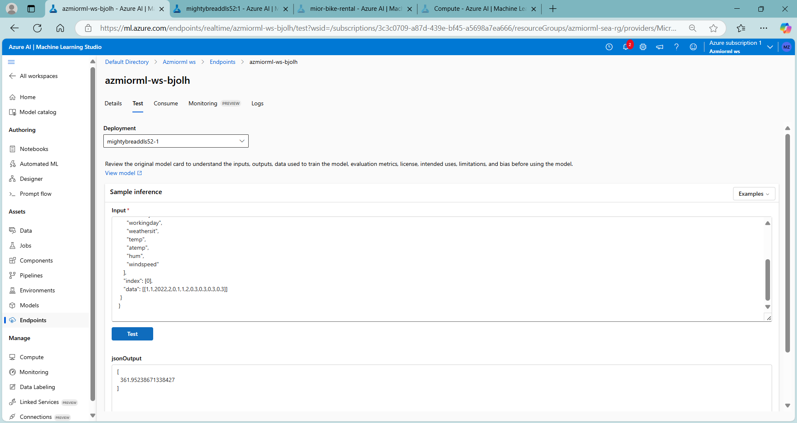

# azmlaml 🔬
azmlaml : #azure_ml #automated_ml

## Objective
To streamline and simplify the process of building, training, and optimizing machine learning models.
Try multiple algorithms and parameters to train multiple models, and identify the best one for your data. 
Train a model that predicts the number of bicycle rentals that should be expected on a given day, based on seasonal and meteorological features.

## Features
- **Dataset** : [Historical bicycle rental details](https://aka.ms/bike-rentals)
- **Studio**  : [Azure ML](https://ml.azure.com)

## AutoML Workflow Progress...

